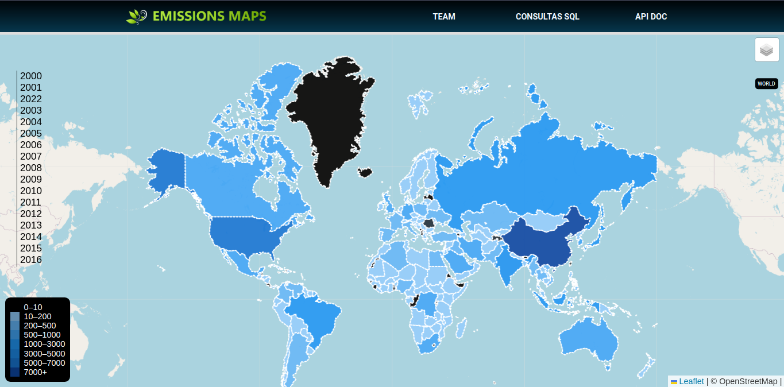

# Mapa de Emisiones de gases del efecto invernadero
 # 
 
## Colaboradores
***
Alex Rodriguez Villavicencio Linkedin: https://www.linkedin.com/in/alexrodriguezvillavicencio

Geronimo Giggi Hippener Linkedin:https://www.linkedin.com/in/geronimo-giggi-hippener-37a397238

Helton John Lirion Linkedin: https://www.linkedin.com/in/helton-lirion-carbajal-70494173/ 

Cristina del V. Zamorano Linkedin: https://www.linkedin.com/in/cristina-zamorano-36623a86

Guillermo Agustín Montero: https://www.linkedin.com/in/guillermo-agustin-montero-93910b216

## Fuentes de Datos
***
* Global Monitoring Laboratory - Earth System Research Laboratories. Disponible en: https://gml.noaa.gov/ 

* York University Ecological Footprint Initiative. National Footprint and Biocapacity Accounts, 2022 edition. Produced for the Footprint Data Foundation and distributed by Global Footprint Network. Disponible en: https://data.footprintnetwork.org.

* Our World in Data. Disponible en:  https://ourworldindata.org/

* Global Footprint Network. Disponible en:  https://www.footprintnetwork.org/